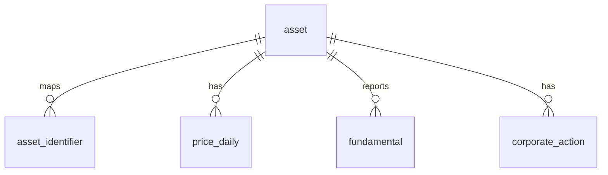

# TeamAlpha Silver v2 스키마

Silver는 Bronze 원문을 분석 가능한 형태로 정규화한다. FMP 응답에 포함된
ETF·fund·비주식 상품은 Bronze에는 남고 Silver 편입 단계에서만 제외된다.
모든 행은 `quality_run_id`로 DQ 실행과 연결된다.



## 1. asset

| 컬럼 | 설명 |
|---|---|
| `asset_id` | 내부 공용 PK |
| `name` | 종목·지수·환율·원자재 이름 |
| `asset_type` | `stock` \| `index` \| `fx` \| `commodity` |
| `instrument_type` | `common_stock`, `preferred_stock`, `adr`, `reit`, `index`, `fx`, `commodity_future_continuous` |
| `exchange` | `KRX`, `NASDAQ`, `NYSE`, `AMEX`, `FX`, `COMMODITY` |
| `currency` | 기존 호환 거래통화 |
| `country_code` | 발행국 코드. ADR은 미국이 아닐 수 있음 |
| `base_currency` | 가격의 표시통화 (`KRW`, `USD`) |
| `price_unit` | 원자재 표준 가격 단위. 그 외 자산은 NULL |
| `listed_from`, `listed_to` | 상장 유효기간 |
| `quality_run_id`, `loaded_at` | 인증 실행과 적재 시각 |

## 2. asset_identifier

| 컬럼 | 설명 |
|---|---|
| `asset_id` | `asset` FK |
| `source` | `KRX`, `DART`, `FMP` |
| `identifier` | ticker, corp code, CIK, CUSIP, ISIN, FX pair 값 |
| `identifier_type` | 식별자 종류 |
| `valid_from`, `valid_to` | 심볼 변경·재사용을 표현하는 유효기간 |
| `quality_run_id`, `loaded_at` | 인증 실행과 적재 시각 |

PK는 `(asset_id, source, identifier_type, identifier, valid_from)`이다. CIK는
한 발행사의 복수 주식 클래스가 공유할 수 있으므로 현재값 전역 유일성에서
제외하며 ticker/CUSIP/ISIN 등은 `valid_to IS NULL`인 현재 구간에서 유일하다.

## 3. price_daily

| 컬럼 | 설명 |
|---|---|
| `asset_id`, `source`, `trade_date` | PK |
| `open`, `high`, `low`, `close` | 원 가격 기준 OHLC |
| `adj_close` | 분할·증자 등 가격조정 종가 |
| `total_return_close` | 배당까지 반영한 총수익 종가 |
| `currency` | 해당 가격의 표시통화 |
| `vwap` | 원천이 제공할 때의 VWAP |
| `available_at` | 해당 행을 실제로 사용할 수 있었던 시각 |
| `volume`, `trading_value` | 거래량·거래대금. 원천에 없으면 NULL |
| `shares`, `market_cap` | 주식수·시가총액. FMP EOD 원천에 없으면 NULL |
| `market` | 날짜별 주식시장 또는 `FX`. 원자재는 NULL |
| `quality_run_id`, `loaded_at` | 인증 실행과 적재 시각 |

KRX는 기존 가격조정 로직을 유지하고 `total_return_close=adj_close`로 둔다.
FMP EOD bulk에서는 `close`가 분할조정 값이고 `adjClose`가 배당조정 값이다.
따라서 FMP `close→adj_close`, `adjClose→total_return_close`로 저장하며, 원 OHLC는
Silver에서 이후 split ratio의 누적곱으로 복원한다. `USDKRW`도 `fx` asset의
`price_daily`로 저장해 원화 환산 시 날짜별 환율을 조인할 수 있다.

FMP 원자재는 제공자 연속선물 시계열이며 `source='FMP_COMMODITY'`로 저장한다.
`USX` 원천 가격은 100으로 나눠 USD로 표준화하고 자산별 `price_unit`을 함께
사용해야 한다. `adj_close=close`, `total_return_close=NULL`이며 주식용 기업행사
조정을 적용하지 않는다. 선물은 음수가 가능하므로 유한값과 OHLC 순서는 강제하되
양수 제약은 적용하지 않는다.

## 4. fundamental

| 컬럼 | 설명 |
|---|---|
| `asset_id`, `source` | 자산과 출처 |
| `statement_type` | `BS`, `IS`, `CF`, `DIVIDEND` |
| `data_basis` | `STANDARDIZED`, `REPORTED` 등 값의 기준 |
| `period_end`, `fiscal_period` | 회계기간 종료일과 FY/Q1~Q4 |
| `fs_type` | `CFS`, `OFS`, `UNKNOWN` |
| `filing_id`, `filed`, `accepted_at` | 공시 ID·접수일·접수시각 |
| `available_date`, `available_at` | PIT 사용가능 날짜·시각 |
| `metric`, `value` | long-format 표준 지표와 값 |
| `currency` | 보고통화. `unit_type=shares`면 NULL 가능 |
| `unit_type` | `currency`, `per_share`, `shares` |
| `revision_key` | 수정 공시를 보존하는 버전 키 |
| `quality_run_id`, `loaded_at` | 인증 실행과 적재 시각 |

PK는 `(asset_id, source, statement_type, data_basis, period_end,
fiscal_period, fs_type, revision_key, metric)`이다. `fundamental_current`는
`available_at` 기준 최신 revision만 제공한다.

## 5. corporate_action

| 컬럼 | 설명 |
|---|---|
| `asset_id`, `source`, `action_key` | PK와 출처별 안정 키 |
| `action_type` | 배당, 분할, 증자, 감자, 합병 등 |
| `announcement_date`, `ex_date` | 발표일과 효력/권리락일 |
| `record_date`, `payment_date` | 명부 기준일과 지급일 |
| `cash_amount`, `adjusted_cash_amount`, `currency` | 원천 주당 현금액, 분할조정 주당 현금액과 통화 |
| `frequency` | 정규화한 지급주기 (`quarterly`, `annual`, `irregular` 등). 없으면 NULL |
| `ratio_numerator`, `ratio_denominator` | 분할 원비율 |
| `expected_price_factor` | 예상 가격 조정계수 |
| `share_count_factor` | 예상 주식수 조정계수 |
| `status`, `confidence`, `filing_id` | 상태·근거 신뢰도·공시 ID |
| `quality_run_id`, `loaded_at` | 인증 실행과 적재 시각 |

DART 구조화 공시와 공시 원문 증거뿐 아니라 FMP split/dividend calendar도
이 테이블에 저장한다. 행사에 포함된 ETF 행은 Bronze에는 남지만 Silver에는
편입된 주식 자산과 매핑되는 행사만 들어온다.

`cash_amount`는 공시 당시의 원 주당배당금이고 `adjusted_cash_amount`는 이후
주식분할을 반영해 기간 간 비교할 수 있는 값이다. FMP의 `dividend`와
`adjDividend`를 각각 매핑한다. 배당수익률은 시점별 가격에 따라 달라지므로
기업행사에 중복 저장하지 않고 `price_daily`와 계산한다.

배당 연구자는 물리 테이블을 하나 더 만들지 않고 `dividend_history` view를
조회한다. 이 view는 `corporate_action`의 `cash_dividend`만 노출한다.

OpenDART `배당에 관한 사항`의 보고기간 단위 값은 기업행사가 아니라 공시 사실이므로
기존 `fundamental`에 `statement_type='DIVIDEND'`, `data_basis='REPORTED'`로 저장한다.
표준 metric은 `cash_dividend_per_share`, `total_cash_dividend`,
`dividend_yield`, `payout_ratio`, `stock_dividend_per_share`를 사용한다. 공시
접수일 다음 날 00:00 UTC를 보수적인 `available_at`으로 사용하고 당기·전기·전전기 중복은
`revision_key`와 보고기간으로 구분한다.

## 품질 이력과 미해결 warning

`dq_run`은 품질검사 실행, `dq_result`는 규칙별 관측 이력, `dq_metric`은 실행별
기준 지표를 누적한다. 인증된 일별 증분의 warning은 `dq_warning_state`가 별도로
OPEN/RESOLVED 상태를 유지한다.

상태 키는 `(mode, scope_key, dataset_name, rule_code)`다. `scope_key`는 명시적 변경
파티션이 있으면 그 파티션, 아니면 증분 대상일이다. 동일 키를 다시 검사해 PASS가
나와야 RESOLVED가 되므로 다른 날짜의 정상 실행이 과거 warning을 지우지 않는다.
현재 남은 항목만 볼 때는 `dq_open_warning` view를 사용한다. 실패하여 Silver에
반영되지 않은 실행과 전체 감사는 이 상태를 변경하지 않는다.

또한 `*_critical_error_guard` CHECK 제약이 인증 run 연결, 텍스트 필수값, 가격
OHLC·양수·비음수·시가총액 대사, 재무 PIT·통화·배당 단위처럼 한 행으로 확정 가능한
Critical/Error 조건을 DB에서도 차단한다. 중복·참조 무결성은 기존 PK·UNIQUE·FK가
담당한다. 여러 행이나 외부 소스가 필요한 규칙은 Python 품질 게이트에 남는다.

## Source mapping

| Silver | Bronze |
|---|---|
| KRX 주식·지수 가격 | `stock/marcap`, `stock/krxapi`, `index/krxapi` |
| FMP 미국주식 가격 | `stock/fmp/eod-bulk` 글로벌 원문을 Silver 유니버스와 조인 |
| FMP 원자재 연속선물 | `commodities/fmp/list`, `commodities/fmp/eod` |
| DART 재무 | `financials/dart`, `financials/dart_full` |
| FMP 재무 | `financials/fmp` bulk·종목별 원문 |
| 국내 기업행사 | `corporate_actions/dart` |
| 국내 배당 지표 | `dividends/dart/alot-matter` |
| 미국 기업행사 | `corporate_actions/fmp` |
| USD/KRW | `fx/fmp/pair=USDKRW` |

## Gold와의 경계

Silver는 원천을 분석 가능한 PIT 데이터로 정규화하는 계층이며 팩터 값은 저장하지
않는다. Gold는 같은 PostgreSQL database의 별도 `gold` schema에서
`public.asset`과 Silver 데이터를 참조한다.

```text
public.asset / public.price_daily / public.fundamental
                         │
                         ▼
 gold.factor -> gold.factor_value -> gold.factor_correlation
```

Gold 3테이블과 12-1 모멘텀 구현은 [gold_schema.md](gold_schema.md) 및
[sql/gold_schema.sql](sql/gold_schema.sql)을 기준으로 한다.
