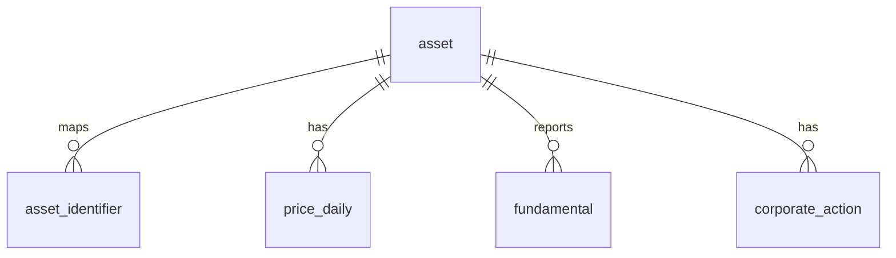

# TeamAlpha Silver v2 스키마

Silver는 Bronze 원문을 분석 가능한 형태로 정규화한다. FMP 응답에 포함된
ETF·fund·비주식 상품은 Bronze에는 남고 Silver 편입 단계에서만 제외된다.
모든 행은 `quality_run_id`로 DQ 실행과 연결된다.

## 1. asset

| 컬럼 | 설명 |
|---|---|
| `asset_id` | 내부 공용 PK |
| `name` | 종목·지수·환율 이름 |
| `asset_type` | `stock` \| `index` \| `fx` |
| `instrument_type` | `common_stock`, `preferred_stock`, `adr`, `reit`, `index`, `fx` |
| `exchange` | `KRX`, `NASDAQ`, `NYSE`, `AMEX`, `FX` |
| `currency` | 기존 호환 거래통화 |
| `country_code` | 발행국 코드. ADR은 미국이 아닐 수 있음 |
| `base_currency` | 가격의 표시통화 (`KRW`, `USD`) |
| `listed_from`, `listed_to` | 상장 유효기간 |
| `quality_run_id`, `loaded_at` | 인증 실행과 적재 시각 |

## 2. asset_identifier

| 컬럼 | 설명 |
|---|---|
| `asset_id` | `asset` FK |
| `source` | `KRX`, `DART`, `FMP` |
| `identifier` | ticker, corp code, CIK, CUSIP, ISIN, FX pair 값 |
| `identifier_type` | 식별자 종류 |
| `valid_from`, `valid_to` | 심볼 변경·재사용을 표현하는 유효기간 |
| `quality_run_id`, `loaded_at` | 인증 실행과 적재 시각 |

PK는 `(asset_id, source, identifier_type, identifier, valid_from)`이다. CIK는
한 발행사의 복수 주식 클래스가 공유할 수 있으므로 현재값 전역 유일성에서
제외하며 ticker/CUSIP/ISIN 등은 `valid_to IS NULL`인 현재 구간에서 유일하다.

## 3. price_daily

| 컬럼 | 설명 |
|---|---|
| `asset_id`, `source`, `trade_date` | PK |
| `open`, `high`, `low`, `close` | 원 가격 기준 OHLC |
| `adj_close` | 분할·증자 등 가격조정 종가 |
| `total_return_close` | 배당까지 반영한 총수익 종가 |
| `currency` | 해당 가격의 표시통화 |
| `vwap` | 원천이 제공할 때의 VWAP |
| `available_at` | 해당 행을 실제로 사용할 수 있었던 시각 |
| `volume`, `trading_value` | 거래량·거래대금. 원천에 없으면 NULL |
| `shares`, `market_cap` | 주식수·시가총액. FMP EOD 원천에 없으면 NULL |
| `market` | 날짜별 시장 또는 `FX` |
| `quality_run_id`, `loaded_at` | 인증 실행과 적재 시각 |

KRX는 기존 가격조정 로직을 유지하고 `total_return_close=adj_close`로 둔다.
FMP EOD bulk에서는 `close`가 분할조정 값이고 `adjClose`가 배당조정 값이다.
따라서 FMP `close→adj_close`, `adjClose→total_return_close`로 저장하며, 원 OHLC는
Silver에서 이후 split ratio의 누적곱으로 복원한다. `USDKRW`도 `fx` asset의
`price_daily`로 저장해 원화 환산 시 날짜별 환율을 조인할 수 있다.

## 4. fundamental

| 컬럼 | 설명 |
|---|---|
| `asset_id`, `source` | 자산과 출처 |
| `statement_type` | `BS`, `IS`, `CF` |
| `data_basis` | `STANDARDIZED` 등 값의 기준 |
| `period_end`, `fiscal_period` | 회계기간 종료일과 FY/Q1~Q4 |
| `fs_type` | `CFS`, `OFS`, `UNKNOWN` |
| `filing_id`, `filed`, `accepted_at` | 공시 ID·접수일·접수시각 |
| `available_date`, `available_at` | PIT 사용가능 날짜·시각 |
| `metric`, `value` | long-format 표준 지표와 값 |
| `currency` | 보고통화. `unit_type=shares`면 NULL 가능 |
| `unit_type` | `currency`, `per_share`, `shares` |
| `revision_key` | 수정 공시를 보존하는 버전 키 |
| `quality_run_id`, `loaded_at` | 인증 실행과 적재 시각 |

PK는 `(asset_id, source, statement_type, data_basis, period_end,
fiscal_period, fs_type, revision_key, metric)`이다. `fundamental_current`는
`available_at` 기준 최신 revision만 제공한다.

## 5. corporate_action

| 컬럼 | 설명 |
|---|---|
| `asset_id`, `source`, `action_key` | PK와 출처별 안정 키 |
| `action_type` | 배당, 분할, 증자, 감자, 합병 등 |
| `announcement_date`, `ex_date` | 발표일과 효력/권리락일 |
| `record_date`, `payment_date` | 명부 기준일과 지급일 |
| `cash_amount`, `currency` | 주당 현금액과 통화 |
| `ratio_numerator`, `ratio_denominator` | 분할 원비율 |
| `expected_price_factor` | 예상 가격 조정계수 |
| `share_count_factor` | 예상 주식수 조정계수 |
| `status`, `confidence`, `filing_id` | 상태·근거 신뢰도·공시 ID |
| `quality_run_id`, `loaded_at` | 인증 실행과 적재 시각 |

DART 구조화 공시와 공시 원문 증거뿐 아니라 FMP split/dividend calendar도
이 테이블에 저장한다. 행사에 포함된 ETF 행은 Bronze에는 남지만 Silver에는
편입된 주식 자산과 매핑되는 행사만 들어온다.

## Source mapping

| Silver | Bronze |
|---|---|
| KRX 주식·지수 가격 | `stock/marcap`, `stock/krxapi`, `index/krxapi` |
| FMP 미국주식 가격 | `stock/fmp/eod-bulk` 글로벌 원문을 Silver 유니버스와 조인 |
| DART 재무 | `financials/dart`, `financials/dart_full` |
| FMP 재무 | `financials/fmp` bulk·종목별 원문 |
| 국내 기업행사 | `corporate_actions/dart` |
| 미국 기업행사 | `corporate_actions/fmp` |
| USD/KRW | `fx/fmp/pair=USDKRW` |
